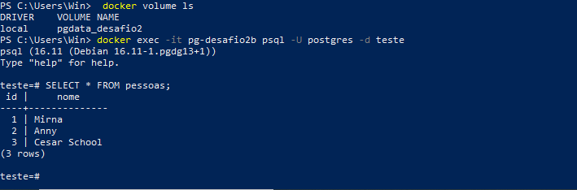

# Desafio 2 – Volumes e Persistência de Dados

Este desafio demonstra o uso de **volumes Docker** para garantir persistência de dados mesmo após remover e recriar containers.  
Utilizamos **PostgreSQL** e provamos que os dados permanecem gravados no volume `pgdata_desafio2`.

---

## Objetivo

- Criar um volume Docker  
- Subir um container PostgreSQL usando esse volume  
- Inserir dados no banco  
- Remover o container  
- Criar outro container usando **o mesmo volume**  
- Verificar que os dados permanecem

---

## Comandos Utilizados

### 1. Criar o volume

```bash
docker volume create pgdata_desafio2
```

---

### 2. Subir o primeiro container

```bash
docker run -d --name pg-desafio2   -e POSTGRES_PASSWORD=senha123   -e POSTGRES_DB=teste   -v pgdata_desafio2:/var/lib/postgresql/data   -p 5432:5432   postgres:16
```

---

### 3. Inserir dados

```bash
docker exec -it pg-desafio2 psql -U postgres -d teste
```

Exemplo:

```sql
CREATE TABLE pessoas (id SERIAL PRIMARY KEY, nome TEXT);
INSERT INTO pessoas (nome) VALUES ('Mirna'), ('Anny'), ('Cesar School');
SELECT * FROM pessoas;
```

---

### 4. Remover o container

```bash
docker rm -f pg-desafio2
```

---

### 5. Subir novo container usando o mesmo volume

```bash
docker run -d --name pg-desafio2b   -e POSTGRES_PASSWORD=senha123   -e POSTGRES_DB=teste   -v pgdata_desafio2:/var/lib/postgresql/data   -p 5432:5432   postgres:16
```

---

### 6. Verificar persistência

```bash
docker exec -it pg-desafio2b psql -U postgres -d teste
SELECT * FROM pessoas;
```

---

## Comprovação da Persistência



Os dados continuam existindo mesmo após a recriação do container, provando o funcionamento do volume Docker.

---

## Conclusão

Este desafio demonstra:

- Persistência real de dados com volumes Docker  
- Containers podem ser descartados sem perda de informações  
- PostgreSQL funciona perfeitamente com volumes nomeados  

