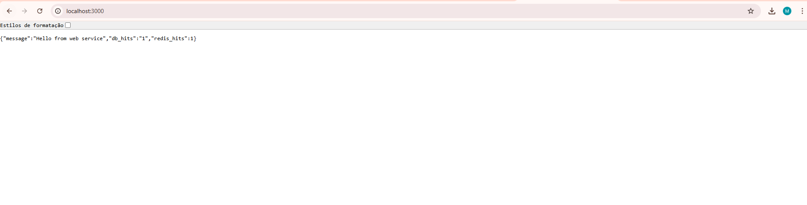
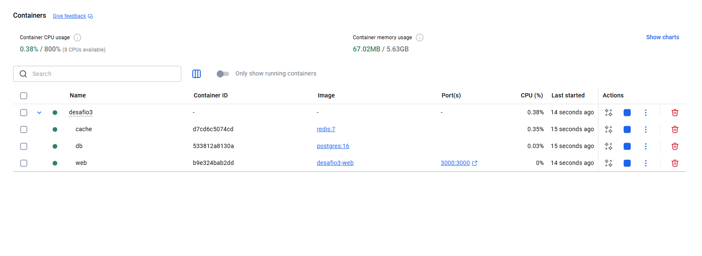

# Desafio 3 – Docker Compose

Este desafio demonstra como orquestrar múltiplos serviços usando **Docker Compose**.  
A stack inclui:

- **Serviço Web (Node/Express)**  
- **PostgreSQL**  
- **Redis**

O objetivo é mostrar como os serviços se comunicam automaticamente usando a rede interna criada pelo Compose.

---

## 🗂 Estrutura do Projeto

```
desafio3/
│── docker-compose.yml
│── web/
│     ├── Dockerfile
│     ├── index.js
│     └── package.json
```

---

## ▶️ Como Executar

### 1. Subir tudo

```bash
docker-compose up --build
```

Isso irá:

- Criar a rede `desafio3_default`
- Criar o volume `desafio3_dbdata_desafio3`
- Criar e iniciar os containers:
  - `desafio3-web`
  - `desafio3-db`
  - `desafio3-cache`

---

## ✔️ Testar a aplicação

A API estará acessível em:

```
http://localhost:3000/
```

---

## 📸 Prints

- **Print do Docker Compose subindo**  



- **Print da resposta da API**  


---

## 🧹 Parar tudo

```bash
docker-compose down
```

Se quiser remover volumes:

```bash
docker-compose down -v
```

---

## ✔️ Conclusão

Este desafio confirma:

- Isolamento e comunicação automática entre containers
- Uso de volumes para persistência
- Rede interna do Compose para serviços interdependentes
