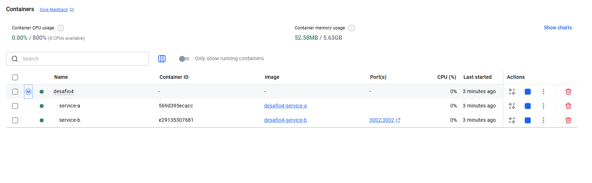
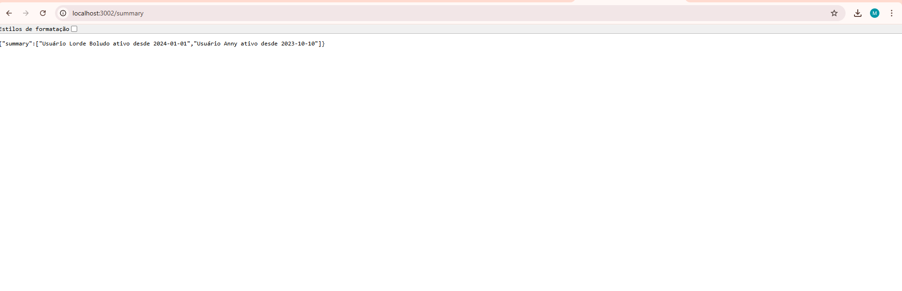

# Desafio 4 – Microsserviços Independentes

Este desafio demonstra a comunicação entre dois microsserviços independentes:

- **Service A** → fornece informações básicas  
- **Service B** → consome o Service A via HTTP e retorna um resumo combinado

Tudo usando Node.js + Express rodando dentro de containers separados.

---

## 🗂 Estrutura do Projeto

```
desafio4/
│── service_a/
│     ├── Dockerfile
│     ├── index.js
│     └── package.json
│
│── service_b/
      ├── Dockerfile
      ├── index.js
      └── package.json
```

---

## ▶️ Como Executar

### 1. Subir os microsserviços

Service A:

```bash
docker build -t service_a desafio4/service_a
docker run -d --name service_a -p 3001:3001 service_a
```

Service B:

```bash
docker build -t service_b desafio4/service_b
docker run -d --name service_b -p 3002:3002 service_b
```

---

## ✔️ Testar a aplicação

### Service A

```
http://localhost:3001/
```

### Service B

```
http://localhost:3002/
```

O Service B deve retornar algo como:

```json
{
  "summary": "Dados combinados dos serviços"
}
```

---

## 📸 Prints 


- Print dos containers rodando  




---

## ✔️ Conclusão

O desafio comprova:

- Comunicação direta entre microsserviços
- Containers isolados, mas interconectados
- Boas práticas de arquitetura distribuída
