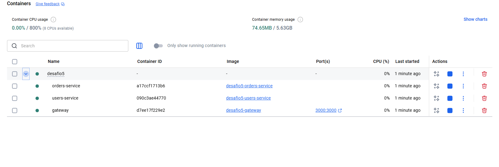
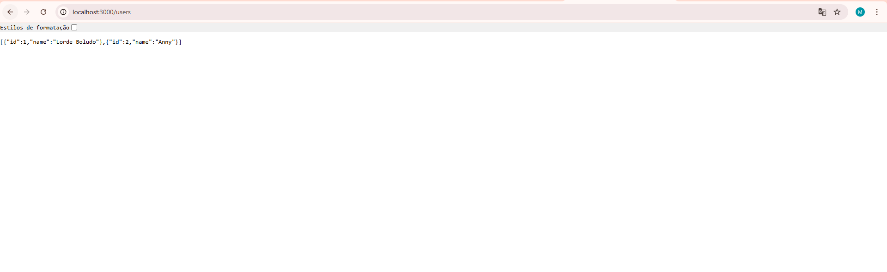
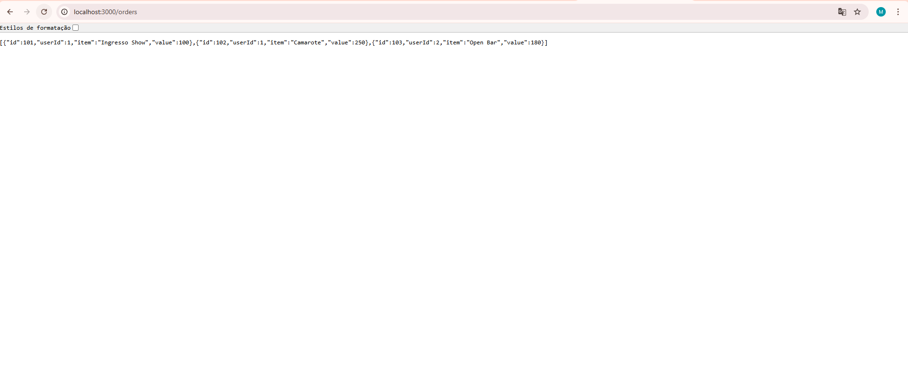
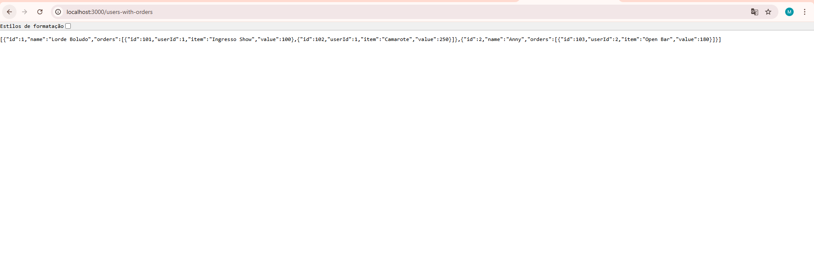

# Desafio 5 – API Gateway com Microsserviços

Este desafio implementa uma arquitetura com **três containers**:

### 1. Gateway (porta 3000)
Recebe todas as requisições e as roteia para:

### 2. Users Service (porta 3001)
Retorna uma lista de usuários

### 3. Orders Service (porta 3002)
Retorna uma lista de pedidos

---

## 🗂 Estrutura do Projeto

```
desafio5/
│── docker-compose.yml
│
│── gateway/
│     ├── Dockerfile
│     ├── index.js
│     └── package.json
│
│── users-service/
│     ├── Dockerfile
│     ├── index.js
│     └── package.json
│
│── orders-service/
      ├── Dockerfile
      ├── index.js
      └── package.json
```

---

## ▶️ Como Executar

No diretório `desafio5`:

```bash
docker-compose up --build
```

Isso irá iniciar:

- `gateway`
- `users-service`
- `orders-service`

---

## ✔️ Testar o Gateway

### Listar usuários

```
http://localhost:3000/users
```

### Listar pedidos

```
http://localhost:3000/orders
```

### Resposta esperada

```json
{
  "users": [...]
}
```

```json
{
  "orders": [...]
}
```

---

## 📸 Prints 

- Print dos containers rodando  
  


  

    

      


---

## ✔️ Conclusão

Este desafio demonstra:

- Padrão API Gateway
- Separação clara entre serviços
- Comunicação interna via Docker Compose
- Arquitetura distribuída escalável
